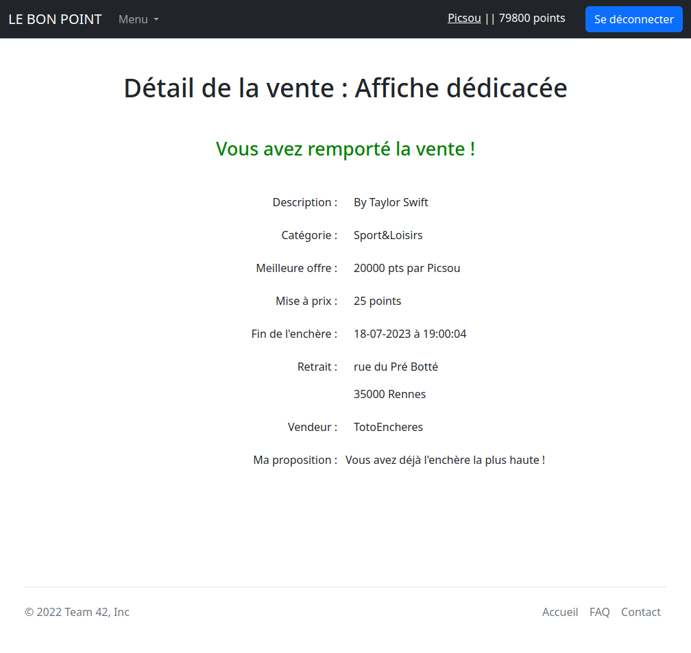

<h3>ENI Enchères ‘Le bon point’ – Projet Java EE </h3>

_Projet en équipe, avec Java EE, JSP, Bootstrap & MySQL_

    

1. Pour setup la base de données : créer une table ‘ENCHERE’ puis y importer le fichier ENCHERE.sql

2. dans src/main/webapp/META-INF, dupliquer le fichier ‘context.lcl.xml’ en ‘context.xml’ avec vos informations adéquates afin de vous connecter à la base de données.

3. Ouvrir le projet dans un IDE et lancer la commande mvn clean install + mvn compile pour générer un fichier war contenant l’ensemble du projet

4. Ajouter aux modules connecteur mysql présent dans le dossier src/main/webapp/WEB-INF/lib (si vous utilisez mysql, sinon configurer en fonction

5. Configurer le serveur Tomcat (ou autre) afin de déployer le fichier war exploded au démarrage du serveur

6. Lancer le serveur & enjoy (il est possible de s’ajouter des points en bruteforçant la base de données)
